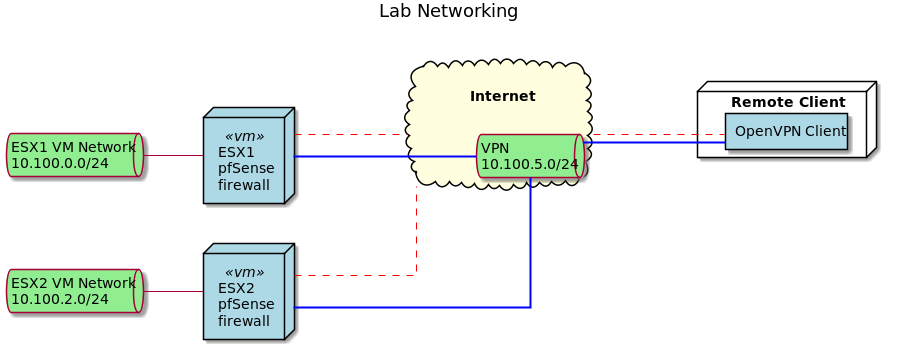

# vSphere Lab

### Prerequisities

* 1Password configured with the organization vault
* OpenVPN client
* [SOPS](https://github.com/mozilla/sops) installed

### Setup OpenVPN

Get these files from 1Password:

* **Remote Client CA - vSphere VM OpenVPN VPN** - `fs-vpn-ca.crt`
* **Remote Client Cert - vSphere VM OpenVPN VPN** - `fs-remote-client.crt`
* **Remote Client Key - vSphere VM OpenVPN VPN** - `fs-remote-client.key`
* **Remote Client TLS Auth Key - vSphere VM OpenVPN VPN** - `tls-auth.key` 

Connect to the VPN using the configuration file `config.openvpn`. 

On linux run:

```bash
sudo openvpn config.openvpn
```

### Accessing the lab

1. Configure `AWS_SECRET_ACCESS_KEY` and `AWS_ACCESS_KEY_ID` with access to the SOPS KMS key.
(this can also be done with a [credentials file](https://docs.aws.amazon.com/sdk-for-php/v3/developer-guide/guide_credentials_profiles.html))

2. Source the environment variables by running: `source /dev/stdin < <( sops -d --input-type binary --output-type binary lab.enc.env )`

3. Run

```shell
karina kubeconfig admin -c green.yml -c lab.yml > green-admin.yml
export KUBECONFIG=green-admin.yml
kubectl get nodes
```

### Updating environment variables:

1. Decrypt environment vars to `lab.env` and update
2. Run `sops -e --input-type binary --output-type binary lab.env > lab.enc.env`
3. Commit `lab.enc.env` NEVER COMMIT `lab.env`

### Lab Network Topology


